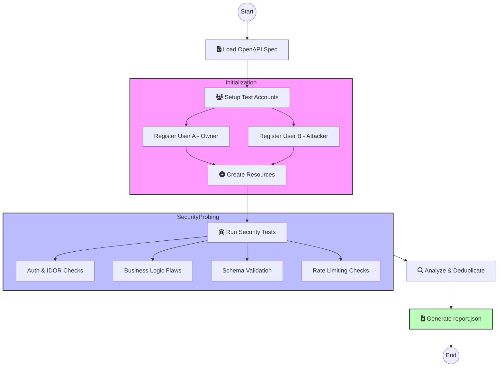

# BackTest-Agent 

An autonomous AI-driven security auditing agent for REST APIs. It probes for vulnerabilities, business logic flaws, and schema deviations using LangGraph and LLM-powered payload generation.

## 🏗 System Architecture

The agent operates as a stateful workflow (DAG) managed by **LangGraph**. Each node represents a distinct phase of the security audit.



## 🛠 How it Works

1.  **Specification Analysis**: The agent parses the `openapi.json` to understand the API surface, required headers, and data schemas.
2.  **Environment Setup**: It dynamically registers two unique users. This allows for **Cross-User Authorization (IDOR)** testing (e.g., can User B delete User A's post?).
3.  **Resource Seeding**: To perform deep testing, the agent creates real resources (posts, comments) under User A's account to provide valid IDs for attack simulations.
4.  **Autonomous Testing**:
    *   **Fuzzing**: Uses LLMs (OpenAI/Groq) to generate edge-case payloads.
    *   **Authorization**: Tests every endpoint with missing tokens, expired tokens, and cross-user tokens.
    *   **Logic Checks**: Attempts "forbidden" actions like following yourself or double-liking.
5.  **Deduplication**: Filters out redundant errors and categorizes findings based on the required 14 security categories.

---

## Docker Setup

The agent is fully containerized for reproducible execution.

### 1. Configure Environment
Create a `.env` file in the root directory:
```env
BASE_URL=https://backend-agent-test.onrender.com
USERNAME=alice
PASSWORD=alice123
OPENAI_API_KEY=your_key_here
GROQ_API_KEY=your_key_here
```

### 2. Run with Docker Compose
```bash
sudo docker compose up --build
```

### 3. View Results
The final audit report is saved to:
`results/report.json`

---

##  Project Structure

*   `agent/`: Core logic (Graph, Clients, Analyzers).
*   `report/`: Report generation logic.
*   `results/`: Output directory for Docker-generated reports.
*   `main.py`: Entry point for the application.
*   `Dockerfile` & `docker-compose.yml`: Containerization configuration.
